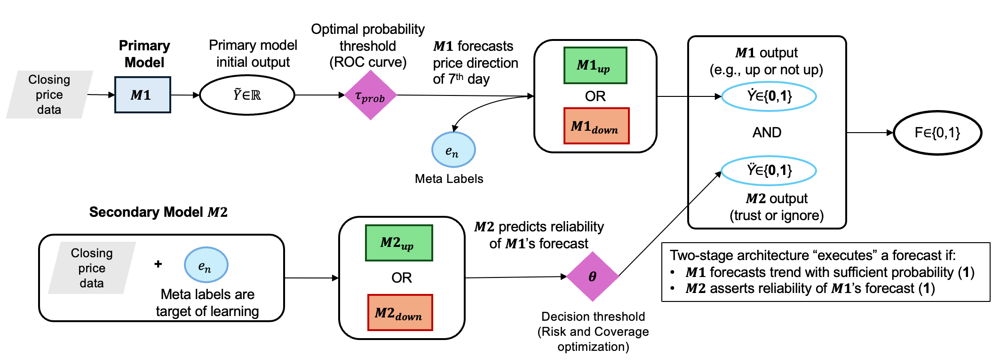
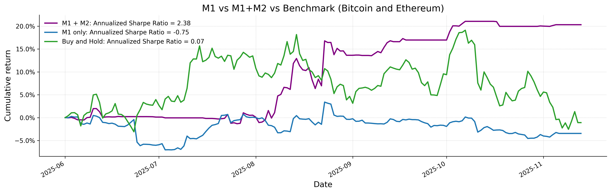
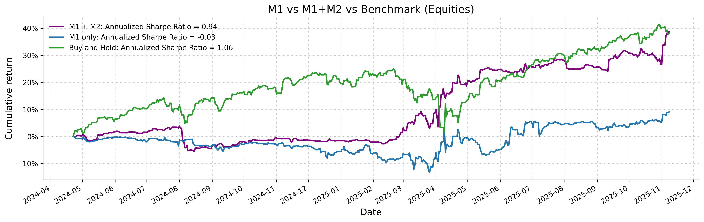

# A Two-Stage Learning Architecture for Reliable Financial Time Series Forecasting

Portfolio and reproducibility repository for our accepted Neurocomputing paper
on reliability-aware financial time series forecasting.

[Accepted paper](accepted-paper.pdf) | [Published article](https://doi.org/10.1016/j.neucom.2026.134703)

## Overview

The framework separates directional forecasting from reliability estimation:

1. A primary time series model (M1) produces an UP or DOWN forecast.
2. CTTS acts as a second-stage model (M2) and estimates whether that forecast
   should be selected or rejected.
3. Performance is evaluated through precision, risk, and selective coverage
   rather than forcing the system to execute every M1 forecast.



The implementation combines Reversible Instance Normalization, a temporal CNN,
learnable positional encoding, a Transformer encoder, and a classification
head. A validation-only risk-coverage policy selects the operating threshold;
the held-out test split is not used for training or threshold selection.


We consider daily data from 2022-08-10 through 2025-11-04. The
configuration preserves the paper experiment's architecture, optimizer,
70/15/15 chronological split, 90-step lookback, and risk-coverage policy.


### Installation

```bash
conda create -n ctts-portfolio python=3.11 -y
conda activate ctts-portfolio
python -m pip install -e ".[dev]"
```


## Backtesting

The paper evaluates the selective forecasts in downstream trading simulations
for cryptocurrency and equity assets.

### Cryptocurrency Assets



### Equity Assets



## Repository Structure

```text
src/ctts/       CTTS model, preprocessing, training, and evaluation
configs/btc/    BTC UP and DOWN paper configurations
data/           Included Chronos BTC M1-derived inputs
docs/           Input data schema
figures/        Selected architecture and backtesting figures
tests/          Portable core checks
```

Generated outputs and checkpoints are excluded from version control. The
repository intentionally starts with one complete BTC case; additional assets,
backbones, and baseline implementations can be added later without changing the
core package layout.

## Citation

Please cite the article using
[DOI 10.1016/j.neucom.2026.134703](https://doi.org/10.1016/j.neucom.2026.134703).

